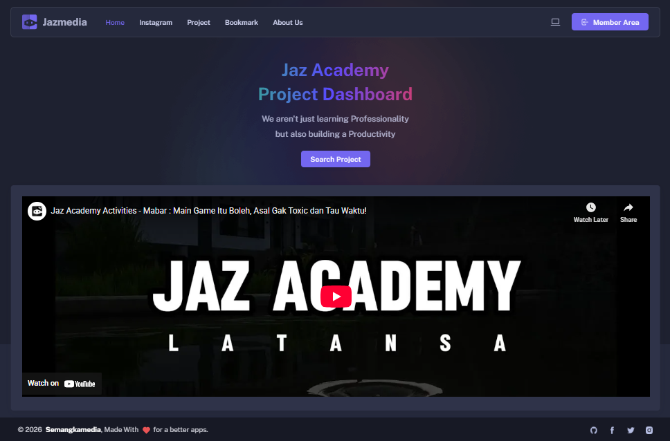

# JazMedia

**JazMedia** is an integrated education management platform designed to manage
courses, academic activities, assessments, projects, and financial operations
in one unified dashboard.

## 🚀 Overview
JazMedia helps educational institutions and academies streamline learning,
monitor student progress, manage projects, and handle financial records
efficiently.

Target users:
- Training centers
- Academies
- Educational startups
- Internal education teams

## 🧩 Core Features
- 📚 Course Management
- 🎓 Academic Dashboard
- 🧪 Assessment & Evaluation
- 🗂 Project Tracking
- 💰 Finance & Payment Monitoring
- 📊 Admin & Analytics Dashboard
- 👥 User Roles (Admin, Mentor, Student)

## 🏗 Tech Stack
- **Frontend:** Vue / Vuetify / Vite
- **Backend:** Node.js / Laravel (PHP)
- **Database:** MySQL
- **Auth:** JWT / Session-based
- **Deployment:** Docker / VPS / Cloud

> Stack may evolve as the platform scales.

## 🧠 Architecture
- Modular monolith (ready for microservice split)
- RESTful API
- Role-based access control
- Separation of concerns (UI, API, Domain)

## 🖥 Screens / Demo

